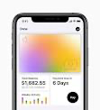

# CASE STUDY HEADING

## Description Header

Place description content here

Contributors:
* Adam Wilson
* Ben Hadden
* Susan RA

### Case Study Title

Apple's background is in personal computing. The company then moved into mobile phone and tablet space. As part of it's offering, it introduces Apple Pay. Apple Pay is a mobile payment and digital wallet service by Apple Inc. that allows users to make payments in person, in iOS apps, and on the web. Google Pay and Venmo are two of their top competitors.

There is a strong focus on security with Apple Pay. For instance, if you use your camera to enter card information, it does not store that information on your phone or in your photos. Instead, it decrypts the data, determines your card’s payment network, and re-encrypts the data with a key that only your payment network (or any providers authorized by your card issuer for provisioning and token services) can unlock.[1] Apple is a Fintech company because they merge their payments across all the users personal devices.

However, given the push behind Apple Pay there are still some vendors that have refused to adopt it, limiting the use of the service. Furthermore, there are security concerns centered around the security of iCloud, the account service heavily utilized in all Apple products.

Apple has been in the forefront of technical innovation for mobile phones, tablets, and laptop devices, with new technology being introduced year by year. 

Apple hit the one trillion market cap in 2019. In the future Apple wants to accomplish more mergers and acquisitions in the 2020’s.

Resources:
* [1] https://support.apple.com/en-us/HT203027 - Overview of Apple Pay Security and Privacy
* [2] https://www.paymentssource.com/slideshow/9-of-apple-pays-major-weaknesses - Overview of Weaknesses
x